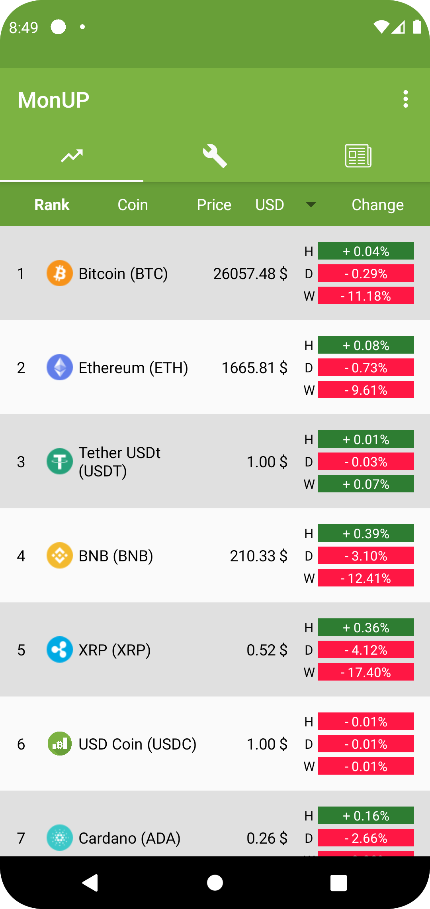
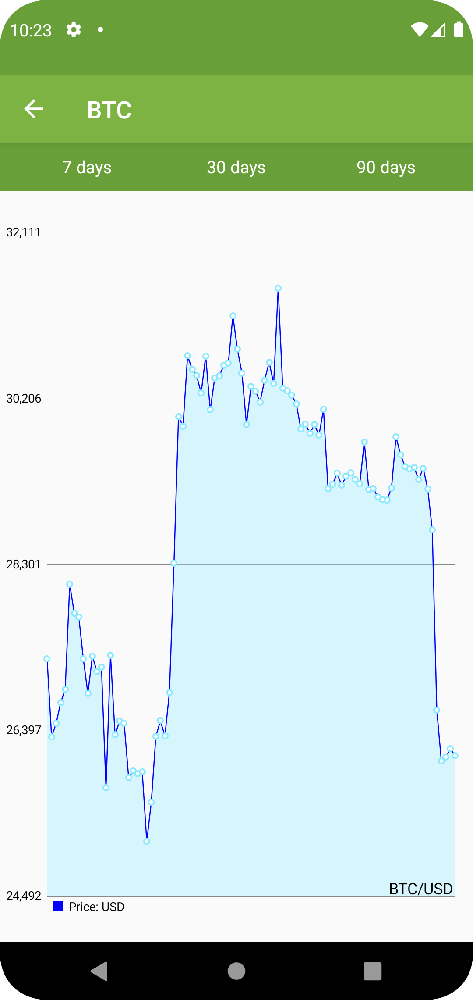
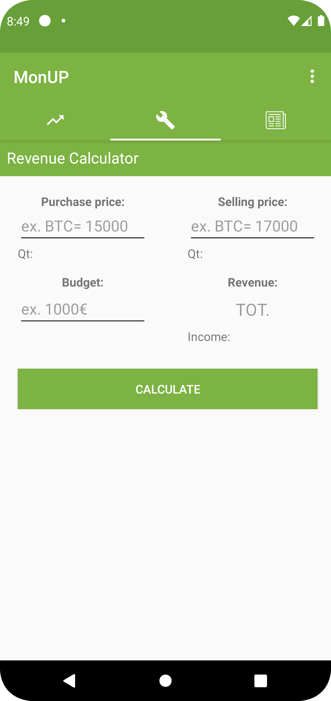

# MonUP

Simple Android app to show crypto prices and news

<!-- ## Description

An in-depth paragraph about your project and overview of use. -->

<!-- ## Getting Started

### Dependencies

* Describe any prerequisites, libraries, OS version, etc., needed before installing program.
* ex. Windows 10

### Installing

* How/where to download your program
* Any modifications needed to be made to files/folders

### Executing program

* How to run the program
* Step-by-step bullets
```
code blocks for commands
``` -->

## Overview

1. Show the most up-to-date Crypto prices

[](doc/example_marketprices.png)
[](doc/example_marketprices2.png)

2. Revenue calculator

[](doc/example_calculator.png)

3. Show the latest news about cryptocurrencies

[](doc/example_news.png)


<!-- ## Help

Any advise for common problems or issues.
```
command to run if program contains helper info
``` -->

## Authors

* [G. Rosa](https://github.com/grosa1/MonUP-App)
* F. Zappone
* S. Dalla Palma

## Version History

* 3.0
    * News section improved
    * Minor improvements for the overall UI experience
* 2.4
    - Implemented Dark Mode
    - Bug fixing and performance improvement

## License

See the LICENSE file for details

## Acknowledgments

* [CoinMarketCap APIs](https://coinmarketcap.com/)
* [Crypto Compare APIs](https://www.cryptocompare.com/)
* [Cryptocurrency icons](https://github.com/cjdowner/cryptocurrency-icons)
* [GNews API](https://gnews.io/)